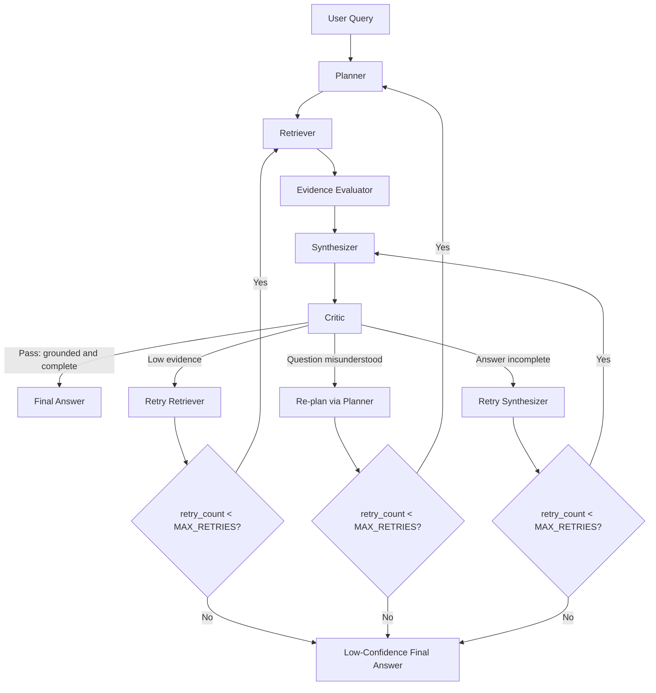

# Day 2 Workflow Diagram Draft

## Locked Path
User Query -> Planner -> Retriever -> Evidence Evaluator -> Synthesizer -> Critic -> Final or Retry or Re-plan

## Retry Conditions
- Low evidence: go back to Retriever.
- Question misunderstood: go back to Planner.
- Answer incomplete: go back to Synthesizer.
- Retry limit exceeded: return low-confidence final answer.
